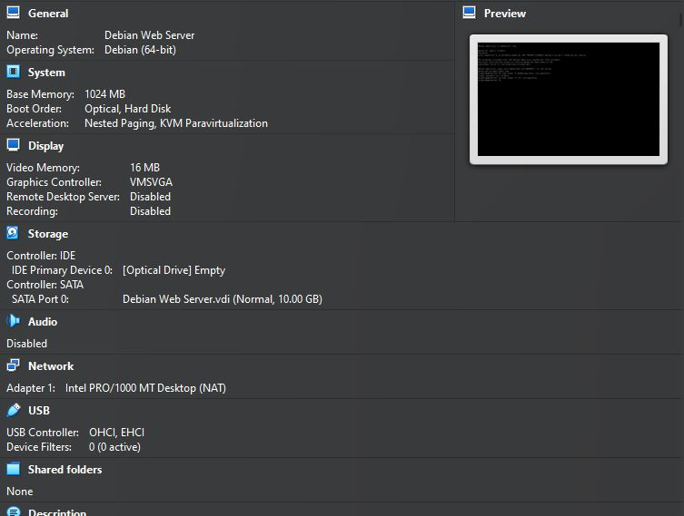
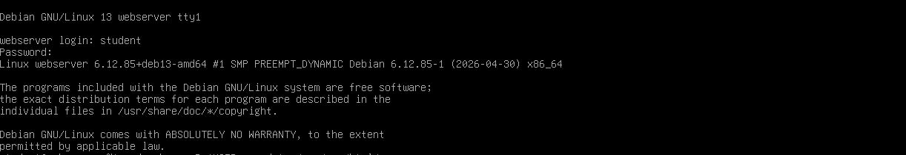
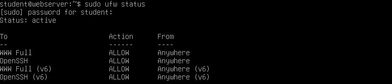
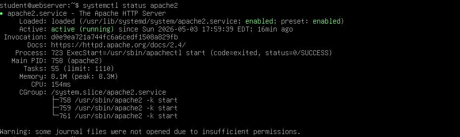
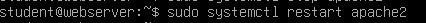
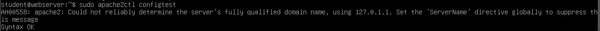
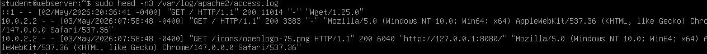

# Deliverable 2

## 1. What are the server hardware specifications (virtual machine settings)?

## 2. What is the Debian Login Screen?

## 3. What is the IP address of my Debian Server Virtual Machine?

## 4. How do you work with the Firewall in Debian?

You can do things such as:
* `sudo ufw status` to tell you the status of the firewall
* `sudo ufw disable` to disable the firewall
* `sudo ufw allow 'Apache'` before you reenable the firewall `sudo ufw enable`

## 4a. How do you check if the Firewall is running?

The `sudo ufw status` tells me the status of my firewall in the webserver VM.

## 4b. How do you disable the Firewall?

`sudo ufw disable` to disable the firewall in the webserver VM.

## 4c. How do you add Apache to the Firewall?

`sudo ufw allow 'Apache'` allows you to add Apache into the firewall.

NOTE: Do this step above before you decide to enable the firewall again (`sudo ufw enable`)

## 5. What different commands do we use to work with Apache?

There are different commands we can use with Apache. For instance:

* `systemctl status apache2` will check the status of Apache in our webserver VM
* `sudo systemctl stop apache2` will halt Apache

## 5a. What is the command you use to check if Apache is running?

`systemctl status apache2` will check the status of Apache to see if it's working or not.

## 5b. What is the command you use to stop Apache?

`sudo systemctl stop apache2` will halt Apache.

## 5c. What is the command you use to restart Apache?

`sudo systemctl restart apache2` will restart Apache if it was off.

## 5d. What is the command used to test Apache configuration?

`sudo apache2ctl config test` will let you know if your Apache configurations are okay. 

NOTE: `apache2ctl config test` does not work on it's own for me, so I used `sudo`.

## 5e. What is the command used to check the installed version of Apache?

`/usr/sbin/apache2 -v` will let you see what version of Apache you have installed.

NOTE: Running `apache2 -v` didn't work that well, so I decided to use the absolute directory.

## 5f. What are some common configuration files for Apache?

`ls /etc/apache2/` will show you some of your config files for Apache.

NOTE: Be careful about `cat` into a file, some of them will run an insane block of information.

## 5g. Where does Apache store logs?

`sudo ls /var/log/apache2` will let you see where and what Apache stores its logs.

NOTE: I used `sudo` again because it will say you don't have permission to view the logs. 

## 5h. What are some basic commands we can use to review logs?

Some commands you can use to review logs are: 
* `sudo head /var/log/apache2/access.log`
* `sudo tail /var/log/apache2/access.log`
* `sudo cat /var/log/apache2/access.log`

NOTE: This particular access.log will be massive, so you're best to use `head -n3`(for example) or `tail -n3` to view this file.