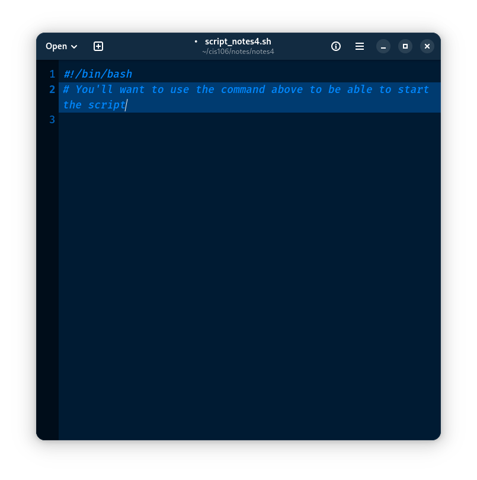
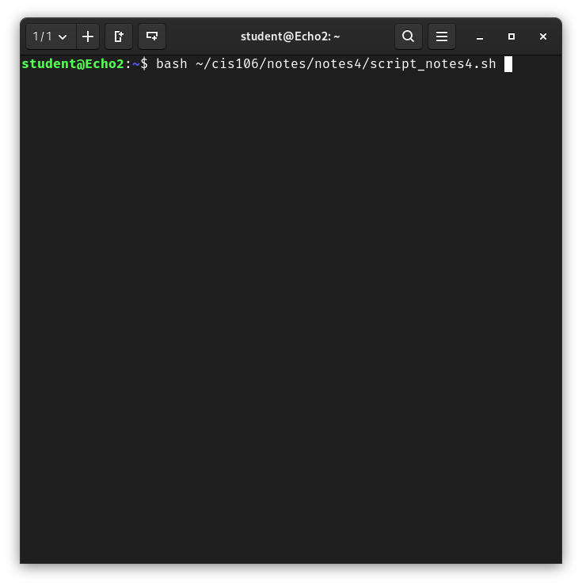
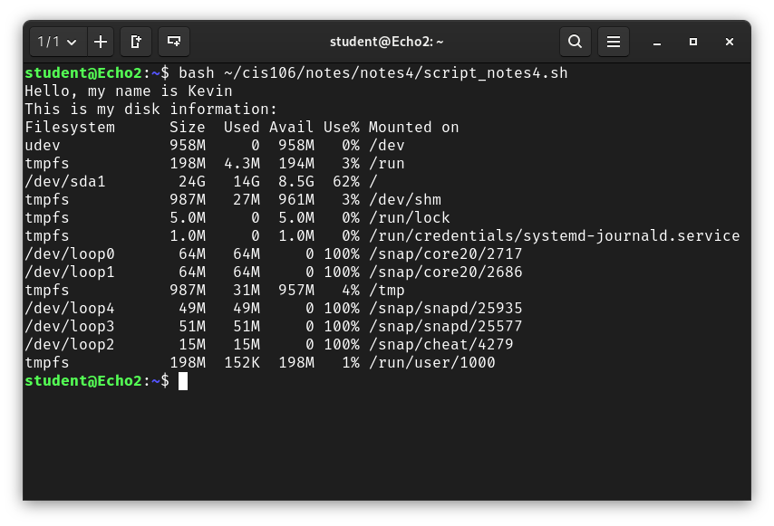

# Notes 4

## Question 1
"How to install and remove software using the APT command"

To install and remove software using the APT command, first you will need to open your terminal. And once you have it open, type "sudo apt install [package]". You can also use "sudo apt install [package] -y" to just say yes to any disclaimers the installer may give you. To remove software, it's simply "sudo apt remove [package]". To remove ALL files so nothing is left on your computer, you can do "sudo apt purge [package].

## Question 2
"How to create a shell script step by step including screenshots and how to run it. Try to be as detailed as possible."

So, the first step to write a script using the text editor. You can save it wherever you want, as long as you remember where you saved it. You should type #!/bin/bash at the beginning of the text editor. 

Either before or after you're done writing your document, you MUST save it as a .sh document. Once you do that, you can save it wherever you'll be able to remember and retrieve it from the terminal

When trying to run the file, I find it easier to write the directory of where the .sh file is located (as shown above). You CAN also go to where you saved the script, right click, and click to open it to the terminal. But I believe learning to see where the directory is through the terminal and typing it is better.
TIP: You can also just type bash [name of the script file] to run it.

If you did everything correctly, you should have an output.