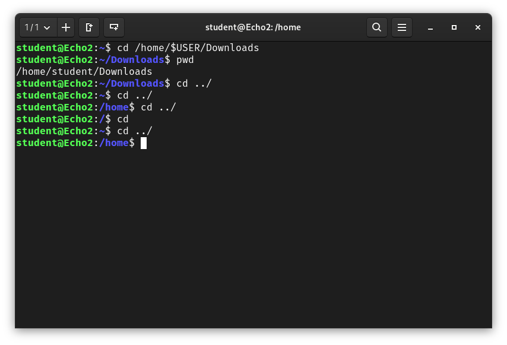
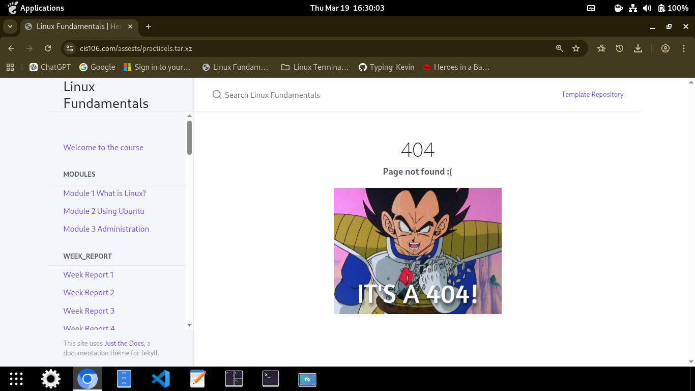
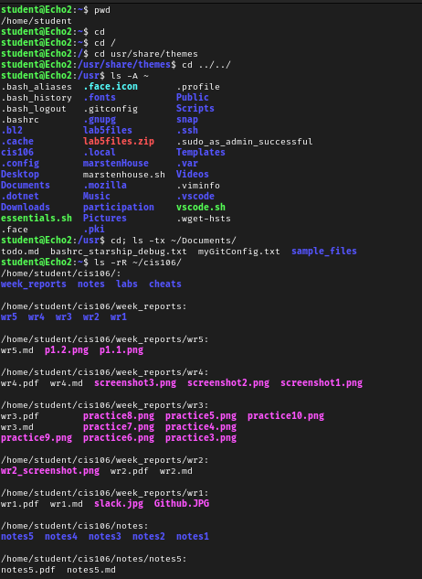
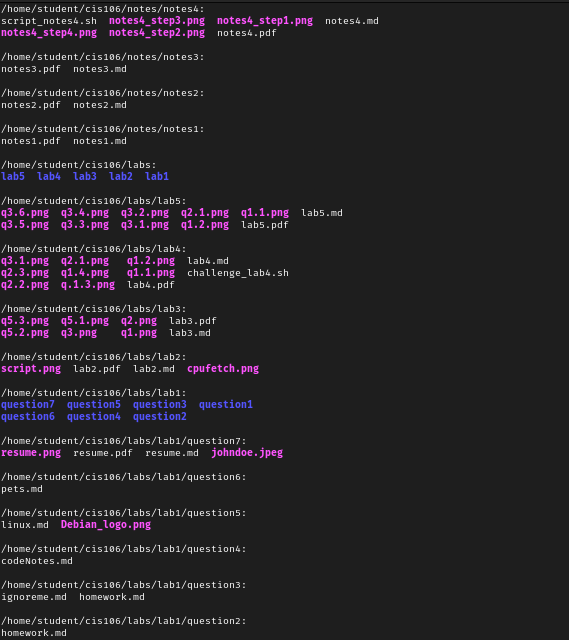
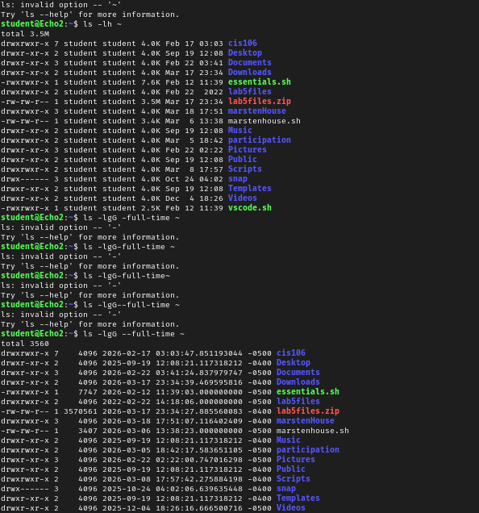
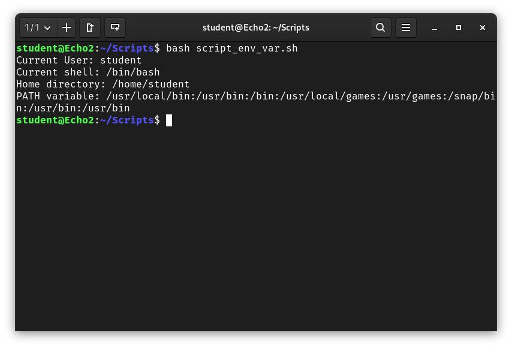
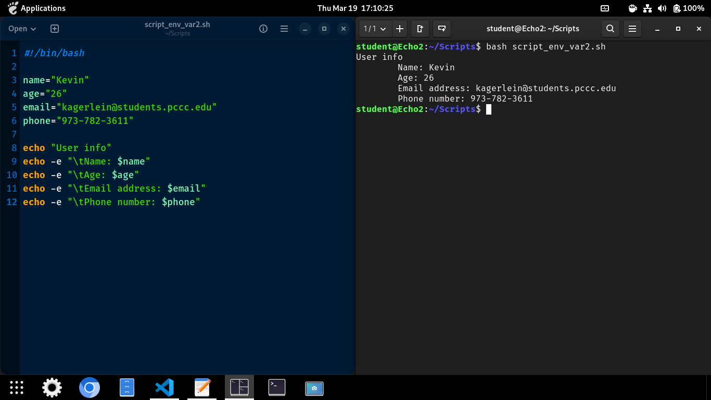

# Week Report 5

## Screenshots for Linux Filesystem

### Practice 1

### Practice 2

### Practice 3

## Screenshots for Shell Scripting 

### Practice 1

### Practice 2

## Links to Lab 5 and Notes 5
Lab 5: https://github.com/Typing-Kevin/cis106/blob/main/labs/lab5/lab5.md

Notes 5: https://github.com/Typing-Kevin/cis106/blob/main/notes/notes5/notes5.md